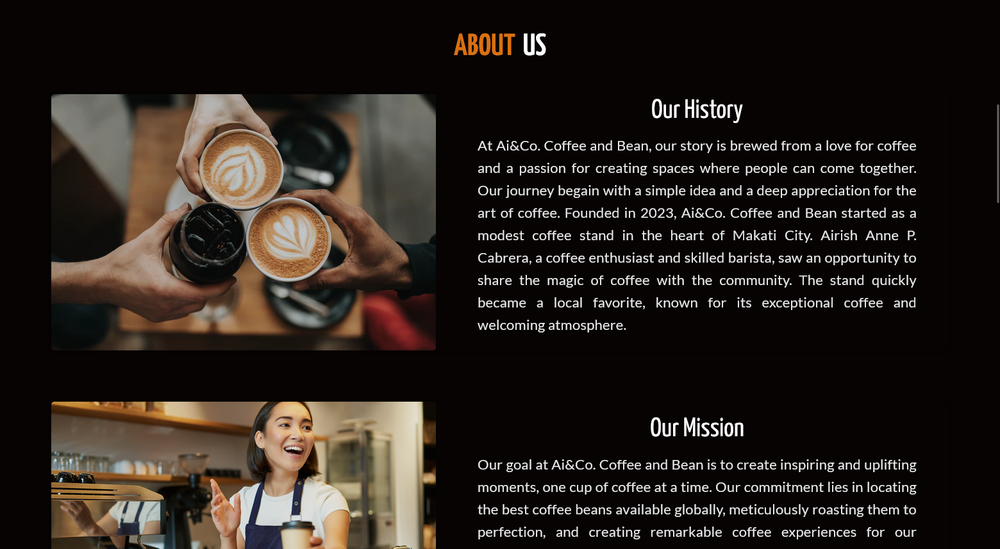
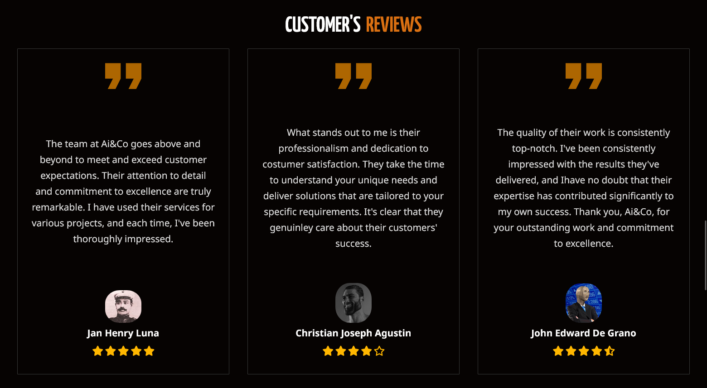
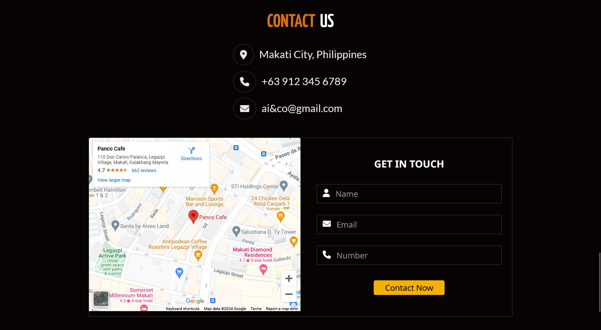
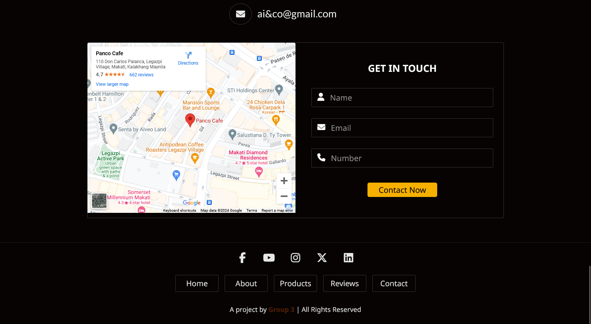

# Ai&Co. Coffe and Bean

At Ai&Co. Coffee and Bean, our story is brewed from a love for coffee and a passion for creating spaces where people can come together. 
Our journey begain with a simple idea and a deep appreciation for the art of coffee. Founded in 2023, Ai&Co. 
Coffee and Bean started as a modest coffee stand in the heart of Makati City. Airish Anne P. Cabrera, a coffee enthusiast and skilled barista, 
saw an opportunity to share the magic of coffee with the community. The stand quickly became a local favorite, known for its exceptional coffee and 
welcoming atmosphere. 

A Performance Task in ICT By Group 3 | All Rights Reserved.
